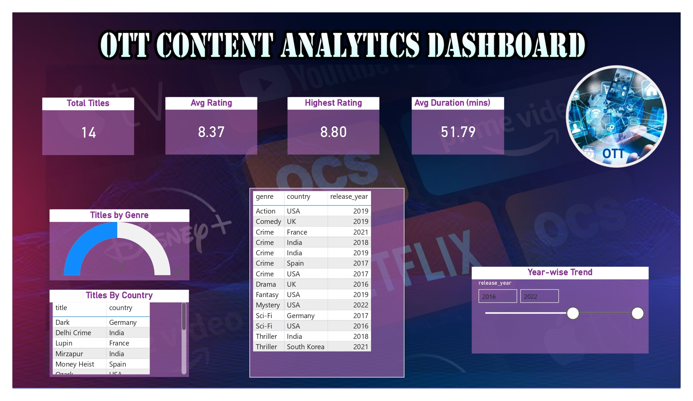
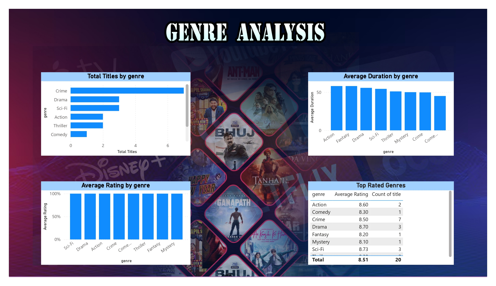
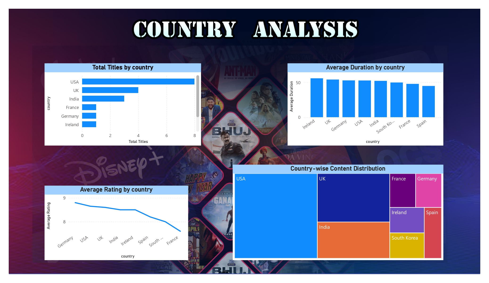
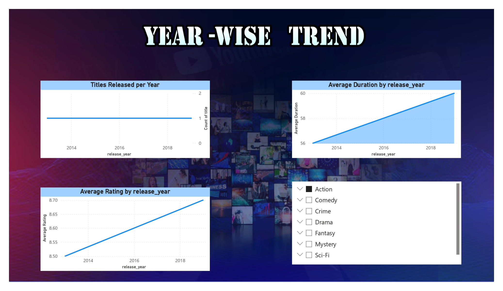

# OTT Content Analytics Dashboard

An end-to-end **Data Analytics project** that analyzes OTT platform content using **SQL (SQLite), Excel, and Power BI** to uncover insights related to genres, countries, ratings, duration, and release trends.

---

## 📌 Project Overview

OTT platforms generate large volumes of content data.  
This project focuses on analyzing that data to understand:

- Content distribution across genres
- Country-wise content contribution
- Rating and duration patterns
- Year-wise release trends

The analysis is presented through **interactive Power BI dashboards**.

---

## 🛠 Tools & Technologies

- **SQL (SQLite)** – Data querying and aggregation  
- **Microsoft Excel** – Exploratory Data Analysis (EDA)  
- **Power BI** – Interactive dashboards and visualizations  

---

## 📂 Project Structure

ott-content-analytics-dashboard/
│
├── Dashboard/
│ ├── dashboard_images/
│ └── OTT_Content_Analysis_Dashboard.pbix
│
├── Data/
│ ├── ott_analysis_clean.db
│ ├── ott_analysis_clean.sqbpro
│ └── ott_content_dataset.csv
│
├── Excel/
│ └── OTT_Content_Performance_Analysis.xlsx
│
├── SQL/
│ └── SQL_Queries.sql
│
└── README.md

---

## 📊 Power BI Dashboards

### 1. OTT Content Overview
- Total titles
- Average & highest ratings
- Average duration
- Overall content summary



---

### 2. Genre Analysis
- Titles by genre
- Average rating by genre
- Average duration by genre



---

### 3. Country Analysis
- Content count by country
- Average rating & duration by country



---

### 4. Year-wise Trend Analysis
- Titles released per year
- Rating and duration trends over time



---

## 📈 Excel Dashboard (EDA)

Excel was used for:
- Initial data exploration
- Validating trends
- Creating summary KPIs before Power BI development

---

## 🧮 SQL Analysis


```sql
-- Total Titles
SELECT COUNT(*) AS total_titles FROM ott_content;

-- Average Rating
SELECT ROUND(AVG(rating), 2) AS avg_rating FROM ott_content;

-- Highest Rating
SELECT MAX(rating) AS highest_rating FROM ott_content;

-- Titles by Genre
SELECT genre, COUNT(*) AS total_titles
FROM ott_content
GROUP BY genre
ORDER BY total_titles DESC;

-- Titles by Country
SELECT country, COUNT(*) AS total_titles
FROM ott_content
GROUP BY country
ORDER BY total_titles DESC;

-- Year-wise Trend
SELECT release_year, COUNT(*) AS total_titles
FROM ott_content
GROUP BY release_year
ORDER BY release_year;
---

